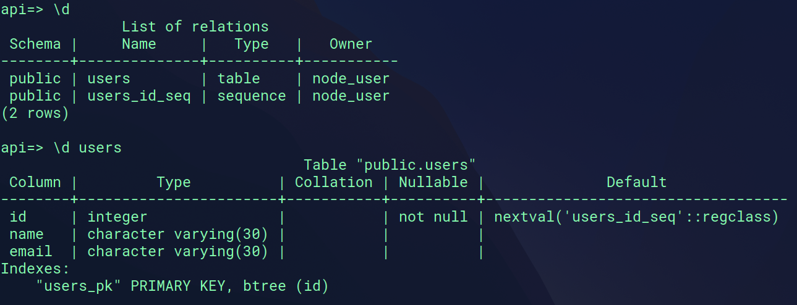

# Simple Demo Nodejs Express Postgres

This repository demonstrates a basic Node.js web app using Express and PostgreSQL.

## Usage

1. Clone the repository.
2. Install dependencies with `npm install`.
3. Set up your PostgreSQL database and update connection details in the code.
4. Run the app using `npm start`.

## Database

database name is `api` and include one table called `users`

Enjoy the demo!
